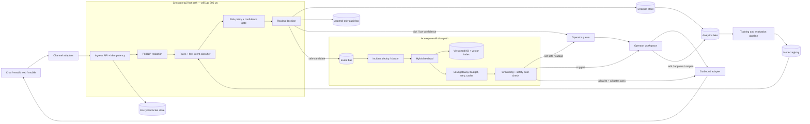

# Целевая архитектура

## Цели и границы

Система принимает тикеты из чата, email, web и mobile, за `p95 ≤ 500 мс` определяет тему, риск и очередь, а затем асинхронно подбирает знания и готовит ответ. Автосообщение разрешено только для небольшой allowlist безопасных intent'ов; денежные операции, безопасность аккаунта, юридические запросы, вред/угрозы, низкая уверенность и любой конфликт правил всегда требуют оператора.

Нагрузочные допущения: `200 000 / день = 2,3 тикета/с` в среднем; пик `20 000 / 600 с = 33,3 тикета/с`. Ingress и быстрый путь проектируются на 200 тикетов/с (6× пик), очередь генерации — минимум на 120 000 событий, то есть час непрерывного пикового потока. Целевые SLO: доступность ingress 99,95%; `p95` быстрого пути 500 мс; 99% безопасных автоответов — за 2 минуты; первый ответ или попадание в операторскую очередь — не позднее 15 минут.

## Компоненты и поток данных

1. Adapter приводит канал к единому `TicketCreated`, а ingress выдаёт `ticket_id`, проверяет схему и idempotency key. Исходный текст шифруется в региональном ticket store с RBAC и сроком хранения; во внешние сервисы он напрямую не передаётся.
2. PII/DLP скрывает идентификаторы. Rules ловят жёсткие risk-сигналы, компактная локальная модель на CPU классифицирует intent и калиброванную уверенность. Policy engine атомарно записывает маршрут, версии моделей/политики и audit event.
3. Risky/OOD/low-confidence тикет сразу появляется у оператора. Безопасный кандидат попадает в durable event bus; быстрый API не ждёт retrieval или LLM.
4. Slow path сначала объединяет дубликаты инцидента, затем делает hybrid retrieval по опубликованному snapshot базы знаний. LLM получает только редактированный текст и найденные фрагменты через gateway с allowlist провайдеров, таймаутом, лимитом токенов и budget circuit breaker.
5. Post-check требует ссылку на актуальный KB-документ, отсутствие запрещённых действий и прохождение policy. В suggest-режиме черновик редактирует оператор; auto-send возможен только для safe allowlist и полностью аудируется.

## Контракты и хранилища

| Объект | Минимальные поля | Хранилище / срок |
|---|---|---|
| `TicketCreated` | ticket id, channel, locale, encrypted body pointer, consent, timestamp | Kafka/Pulsar 7 дней; body отдельно |
| `TriageDecision` | intent, confidence, risk reasons, route, model/policy versions, latency | Postgres 1 год |
| `AnswerDecision` | KB ids/versions, prompt hash, model, token count, outcome, approver | append-only/WORM audit 3 года* |
| Knowledge snapshot | approved text, owner, valid-from/to, product/version, embedding | object store + search/vector index |
| Feedback | operator edit, transfer, resolve, reopen-7d, CSAT | analytics lake; PII-minimized |

`*` Точный срок утверждают legal/DPO. Тексты, fingerprints и служебные метаданные имеют раздельные retention policies. Секреты находятся в secret manager, доступы журналируются.

## Латентность, масштабирование и отказоустойчивость

Бюджет быстрого пути: gateway/idempotency 50 мс, DLP 60 мс, классификатор 80 мс, policy 30 мс, сохранение решения и publish 120 мс, сетевой/пиковый запас 160 мс. Сервисы stateless и масштабируются горизонтально; 16 partitions сохраняют запас и порядок по `user_id`, consumer lag управляет autoscaling генераторов. Outbox между decision store и event bus исключает потерю события; каждое действие идемпотентно по `(ticket_id, decision_version)`.

| Сбой | Безопасная деградация |
|---|---|
| LLM/провайдер недоступен, timeout или исчерпан бюджет | Один ограниченный retry, затем template acknowledgement и операторская очередь; автоответ не отправляется |
| Fast classifier недоступен или OOD-rate высок | Только hard rules, маршрут `manual_triage`, приоритет по SLA |
| KB/index недоступен или документ устарел | Генерация запрещена; оператор видит тикет без черновика |
| Event bus перегружен во время инцидента | Backpressure, приоритет risky/SLA-near тикетов, dedup массовых обращений; pre-approved incident message только после activation incident commander |

Multi-AZ применяется для ingress, event bus и stores; RPO решений — до 1 минуты, RTO быстрого пути — до 15 минут. Kill switch отдельно отключает auto-send, не останавливая классификацию, маршрутизацию и сбор shadow-метрик.

## Что реализовано в PoC

В [`support_ticket_ai/engine.py`](../support_ticket_ai/engine.py) реально работают нормализация, regex-редакция PII, rule classifier, risk gate, лексический retrieval, allowlist автоответов, fail-closed генератор и JSONL audit. Event bus, БД, векторный поиск, обученная модель, внешний LLM, UI и autoscaling — элементы целевого дизайна; в PoC их заменяют синхронный вызов, JSON knowledge base и локальный шаблон.

